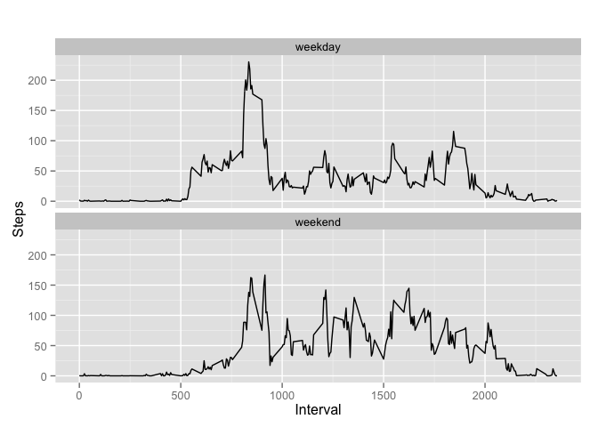

# Reproducible Research: Peer Assessment 1

##Introduction
The purpose of this assignment is to answer multiple questions about a set of activity monitoring data and draw conclusions based on those results. 

##Data
The data comes from a personal activity monitoring device. This device collects data at 5 minute intervals throughout the day and consists of two months of data (10/2012, 11/2012). The data describes the number of steps an anonymous individual takes in 5 minute intervals. 

##Analysis
It also lists the date and interval for the each set of recorded steps. Within this data set, there are 2,304 missing values for steps. Due to this, I wanted to compare the average number of steps by interval excluding those missing values to the average number of steps by interval with an imputed daily average for that missing interval. Based on the results, the mean showed no change, and median showed a nominal change. Additional, I reviewed the trend of steps by interval and compared activity levels between weekdays and weekends.

##Conclusions
Based on the relatively small change in median and no change in mean, I believe the method of imputation will not skew conclusion of results. When reviewing the average steps by interval across all days, I found that interval 835 has the highest average steps. Unfortunately, I don't have enough background information behind when that interval takes place to draw further conclusions. Next, I compared the activity level between weekdays and weekends, and trending shows that weekends have a steadier flow of activity while weekdays have a sharp spike and then remain at relatively low levels throughout the rest of the intervals.

Note: These functions were written on a Mac and may have difficulties when read on Windows machines.


## Loading and preprocessing the data  

```r
library(dplyr)
```

```
## Warning: package 'dplyr' was built under R version 3.1.2
```

```
## 
## Attaching package: 'dplyr'
## 
## The following object is masked from 'package:stats':
## 
##     filter
## 
## The following objects are masked from 'package:base':
## 
##     intersect, setdiff, setequal, union
```

```r
library(ggplot2)

#Read the file into R memory
Activitydata <- read.csv("activity.csv",colClasses=c("numeric","character","numeric")) 

#Pull out character date and transform to a date factor. Then recombine with original dataset.
AD_date <- Activitydata$date
date <- strptime(AD_date, format="%Y-%m-%d")
act_data <- cbind(Activitydata[,c(1,3)],date)
```

## What is mean total number of steps taken per day?  
Create a histogram of the total number of steps per day ignoring NAs.


```r
#omit NAs from dataset
act_data2 <- na.omit(act_data)

#aggregate data steps to get total number per day
act_data_sum <- aggregate(steps ~ date, act_data2, sum)

#create histogram of total steps by day.
hist(act_data_sum$steps, main="Total steps per day", xlab="Total steps in a day")
```

 


```r
#Calculate the average number of steps per day ignoring NAs.
mean(act_data_sum$steps)
```

```
## [1] 10766.19
```


```r
#Calculate the median number of steps per day.
median(act_data_sum$steps)
```

```
## [1] 10765
```
**The average total steps per day is 10766.**  
**The median total steps per day is 10765.**

## What is the average daily activity pattern? 

Time series plot which shows the average steps by interval across all days.


```r
#aggregate the average steps by 5 minute interval
act_data_interval <- aggregate(steps ~ interval, act_data2, mean)

#create a line plot of the average number of steps by interval across all days.
with(act_data_interval, plot(interval, steps,, type = "l", main="Average steps by interval across all days", xlab = "Interval", ylab = "Steps"))
```

 


```r
#find max row and pull out that id.
row_id <- which.max(act_data_interval$steps)

#read max row to determine interval with max steps.
act_data_interval[row_id, ]
```

```
##     interval    steps
## 104      835 206.1698
```
  
**Interval 835 with 206 steps is the 5-minute interval with the maximum average steps.**


## Imputing missing values  

```r
#create dataset with only NAs.
act_data_NA <- act_data[!complete.cases(act_data),]

#count the number of NAs
nrow(act_data_NA)  
```

```
## [1] 2304
```

**There are a total of 2304 missing values in the data set.**  
**Imputation method: Replace NAs with the average steps for the respective 5 minute interval.**


```r
#replace NAs with average steps for the respective 5 minute interval.
for (i in 1:nrow(act_data)){  
  if (is.na (act_data$steps[i] )) {  
    interval_est <- act_data $interval[i]   
    row_id <- which(act_data_interval$interval == interval_est)  
    steps_est <- act_data_interval$steps[row_id]  
    act_data$steps[i] <- steps_est  
  }  
}  

#sum the step per day
act_data_imputation <- aggregate(steps ~ date, act_data, sum)  

#generate a histogram with the total steps in a day including the new values.
hist(act_data_imputation$steps, main="Total steps per day with imputation for NAs", xlab="Total steps in a day")
```

 


```r
#Calculate the average number of steps per day.  
mean(act_data_imputation$steps)
```

```
## [1] 10766.19
```

 

```r
#Calculate the median number of steps per day. 
median(act_data_imputation$steps)
```

```
## [1] 10766.19
```
**When comparting the average total steps with imputation (10766) to the average total steps ignoring missing values (10766), we see there is no change between the two .**  
  
**When comparting the median of the total steps with imputation (10766) to the median of the total steps ignoring missing values (10765), we see there is a relatively small change between the two .**  


## Are there differences in activity patterns between weekdays and weekends?


```r
#add a column indicating day of the week.
act_data$day <- weekdays(act_data$date)

#add an empty vector with the first entry as "weekday"
act_data$day_type <- c("weekday")

#If day is Saturday or Sunday, denote weekend
for (i in 1:nrow(act_data)){  
  if (act_data$day[i] == "Saturday" || act_data$day[i] == "Sunday"){  
    act_data$day_type[i] <- "weekend"  
  }  
}

#convert to a factor variable
act_data$day_type <- as.factor(act_data$day_type)

#aggreate steps by interval across all days.
new_interval_imputation <- aggregate(steps ~ interval+day_type, act_data, mean)

#create plot to compare weekend to weekday.
qplot(interval, steps, data=new_interval_imputation, geom=c("line"), xlab="Interval", 
      ylab="Steps", main="") + facet_wrap(~ day_type, ncol=1)
```

 
